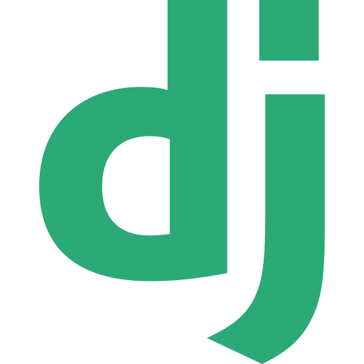
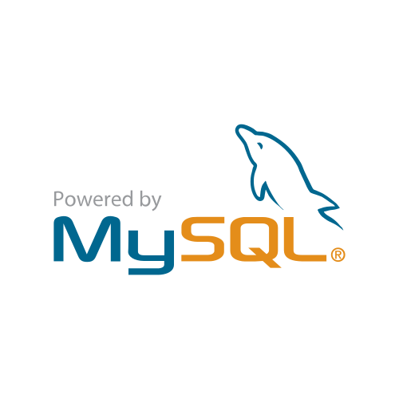
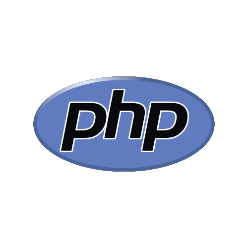
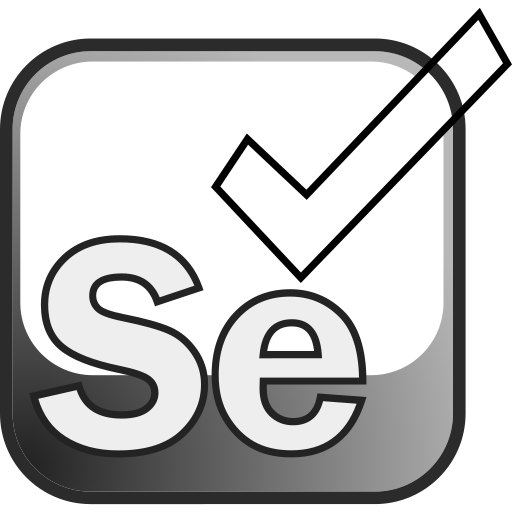
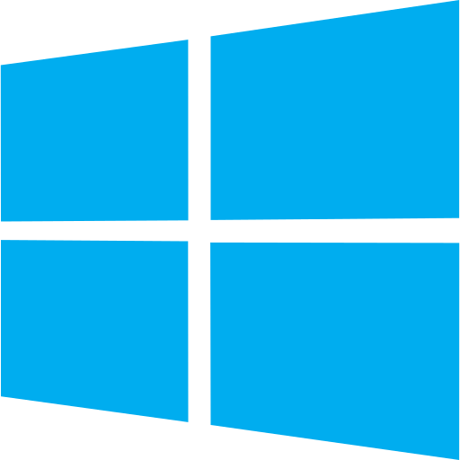

  

  

     With 7 years of coding experience, I began my journey in software development and gradually transitioned into specializing in Data Science and artificial intelligence. My expertise encompasses all facets of the field, including Machine learning, Deep learning, Reinforcement learning, and related areas such as Computer vision, NLP, ...

  

As says Sajid Shaikh, this led me to various different domains of programming, which include front-end, back-end, Web-scraping, and API development. I don't want to stop learning, neither do I want to slow down my learning. It's fascinating how software engineering rapidly changes over time and there's always something to learn even for experienced ones.
    
 
  

  

<h3 align="center">Technologies that I like to work with: </h3>

  
  

    

 
<h3 align="center" style="font-family: 'Ubuntu';"> Contact </h3>

 

<h3 align="center" style="font-family: 'Ubuntu';"> Social Media </h3>

